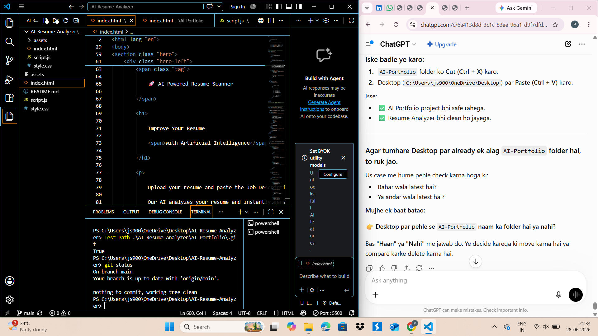

# 🤖 AI Smart Email Assistant

An AI-powered Email Assistant built using **n8n** and **Google Gemini AI** that automatically classifies incoming emails, analyzes their priority and sentiment, generates professional replies, and automates email workflows.

---

# 📌 Project Overview

This project automates email management using Artificial Intelligence. Instead of manually reading and replying to every email, the workflow analyzes each incoming email and generates an intelligent response.

The workflow is designed using **n8n** and integrates **Google Gemini AI**, **Gmail**, and **Google Sheets** to streamline email handling.

---

# ✨ Features

- 📧 Automatically reads incoming Gmail messages
- 🤖 Classifies emails into categories
- ⭐ Detects email priority (High / Medium / Low)
- 😊 Performs sentiment analysis
- 📝 Generates professional AI replies
- 📊 Stores email details in Google Sheets
- 📩 Creates Gmail draft replies automatically
- ⚡ Fully automated workflow using n8n

---

# 🛠 Tech Stack

- n8n
- Google Gemini AI
- Gmail
- Google Sheets
- AI Agent
- Structured Output Parser
- Workflow Automation

---

# 🔄 Workflow

```text
Gmail Trigger
      │
      ▼
Edit Fields
      │
      ▼
AI Agent
(Google Gemini AI)
      │
      ▼
Structured Output Parser
      │
      ▼
Google Sheets
      │
      ▼
IF Node
      │
      ├── Reply Required → Gmail Draft
      └── No Reply
```

---

# 📸 Workflow Screenshot



---

# 🚀 How It Works

1. Gmail Trigger detects a new email.
2. Email subject and body are extracted.
3. Google Gemini AI analyzes the email.
4. AI determines:
   - Email Category
   - Priority
   - Sentiment
   - Summary
   - Reply Requirement
5. Email information is stored in Google Sheets.
6. If a reply is required, a professional Gmail draft is created automatically.

---

# 📂 Repository Structure

```text
ai-smart-email-assistant/
│
├── workflow.json
├── README.md
└── screenshots/
    └── workflow.png
```

---

# 🎯 Future Improvements

- Multi-language support
- Spam Detection
- Attachment Summarization
- CRM Integration
- Calendar Integration
- AI Email Scheduling

---

# 👨‍💻 Author

**Priyanshu Saini**

- GitHub: https://github.com/priyanshu-saini78
- LinkedIn: https://www.linkedin.com/in/priyanshusaini-ai/

---

⭐ If you found this project useful, consider giving it a star.
