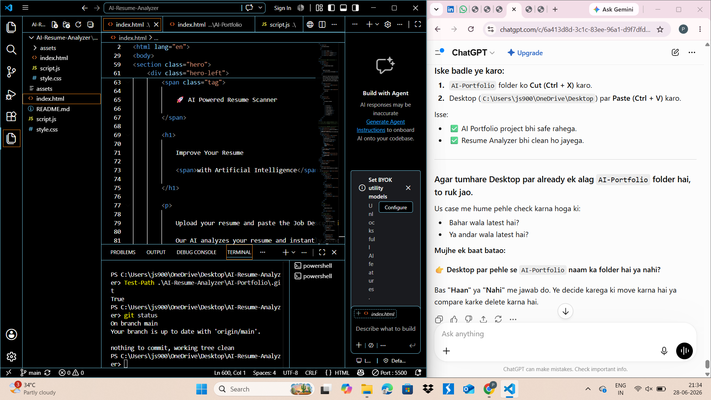

# 🤖 AI Smart Email Assistant

An AI-powered email automation workflow built using **n8n, Google Gemini AI, Gmail, and Google Sheets**. The workflow automatically analyzes incoming emails, classifies them, determines their priority and sentiment, generates professional replies, and creates Gmail drafts.

---

## 📌 Project Overview

The AI Smart Email Assistant automates email management using artificial intelligence.

Instead of manually reviewing every incoming email, the workflow uses Google Gemini AI to analyze email content, identify its category, determine its priority and sentiment, and generate professional replies when required.

The workflow was developed entirely in **n8n** and integrates Google Gemini AI, Gmail, and Google Sheets.

The project was successfully built and tested during a 14-day n8n Cloud trial. After the trial ended, the hosted workflow became inactive.

---

## 📊 Project Status

**Status:** Built and successfully tested; currently inactive.

- Created the complete email automation workflow using n8n.
- Integrated Google Gemini AI, Gmail, and Google Sheets.
- Successfully tested the workflow during the 14-day n8n Cloud trial.
- Implemented AI-powered email classification, priority detection, and sentiment analysis.
- Generated professional email replies using Google Gemini AI.
- Configured the workflow to create Gmail drafts instead of automatically sending emails.
- The n8n Cloud trial has ended, so the hosted workflow is currently inactive.
- A screenshot of the tested workflow is included in this repository.

**Note:** This project consists of an n8n automation workflow. No separate frontend or backend was developed.

---

## ✨ Features

- 📧 Automatically reads incoming Gmail messages
- 🤖 AI-powered email classification
- ⭐ Email priority detection (High / Medium / Low)
- 😊 Sentiment analysis
- 📝 AI-generated professional email replies
- 📊 Email data storage in Google Sheets
- 📩 Automatic Gmail draft creation
- 🔀 Conditional email routing
- ⚡ Automated email processing using n8n

---

## 🛠 Tech Stack

| Technology | Purpose |
|---|---|
| n8n | Workflow automation |
| Google Gemini AI | Email analysis and reply generation |
| Gmail | Email monitoring and draft creation |
| Google Sheets | Email data storage |
| AI Agent | AI-powered email processing |
| Structured Output Parser | Structured AI output |
| Webhooks / Integrations | Workflow connectivity |

---

## 🔄 Workflow Architecture

```text
Gmail Trigger
      │
      ▼
Edit Fields
      │
      ▼
AI Agent
(Google Gemini AI)
      │
      ▼
Structured Output Parser
      │
      ▼
Google Sheets
      │
      ▼
IF Node
      │
      ├── Reply Required → Gmail Draft
      │
      └── No Reply
```

---

## 🚀 How It Works

1. **Gmail Trigger:** Detects incoming Gmail messages.
2. **Edit Fields:** Extracts relevant email information, such as the sender, subject, and message body.
3. **AI Agent:** Sends the email information to Google Gemini AI for analysis.
4. **Email Classification:** The AI analyzes the email and determines:
   - Email Category
   - Priority
   - Sentiment
   - Summary
   - Reply Requirement
5. **Structured Output Parser:** Organizes the AI-generated response into structured data.
6. **Google Sheets:** Stores the processed email information.
7. **IF Node:** Checks whether a reply is required.
8. **Gmail Draft:** Creates a professional email draft when a reply is required.

The workflow creates draft replies for review rather than automatically sending emails.

---

## 📸 Workflow Screenshot



The screenshot provides visual evidence of the n8n workflow developed for this project.

---

## 🧪 Testing

The workflow was successfully tested during the 14-day n8n Cloud trial.

Testing covered the workflow's email processing and automation steps, including:

- Detecting incoming Gmail messages
- Extracting email information
- Analyzing emails using Google Gemini AI
- Classifying emails
- Determining email priority and sentiment
- Generating professional replies
- Storing email information in Google Sheets
- Creating Gmail draft replies when required

**Test Result:** Successfully tested during the n8n Cloud trial.

The hosted workflow is currently inactive because the trial has ended.

---

## 📂 Repository Structure

```text
ai-smart-email-assistant/
│
├── workflow.json
├── README.md
└── screenshots/
    └── workflow.png
```

---

## 🔧 How to Import and Run the Workflow

The original n8n Cloud instance is no longer active. However, the workflow can be imported into another n8n instance if the workflow JSON file is available.

### 1. Open n8n

Open your n8n instance.

### 2. Import the Workflow

Import the `workflow.json` file into n8n.

### 3. Configure Google Gemini

Add your own Google Gemini API credentials to the relevant node.

### 4. Configure Gmail

Connect your Gmail account to the Gmail Trigger and Gmail Draft nodes.

### 5. Configure Google Sheets

Connect your Google Sheets account and select the spreadsheet where email information will be stored.

### 6. Review the Workflow

Check the node connections, credentials, spreadsheet settings, and Gmail configuration.

### 7. Test the Workflow

Run the workflow with sample emails to verify that email processing, classification, and draft creation work correctly.

**Note:** The workflow requires a configured n8n instance and valid credentials. Importing the workflow does not automatically restore the original hosted instance.

---

## 🎯 What This Project Demonstrates

This project demonstrates practical experience with:

- n8n workflow automation
- AI integration using Google Gemini
- Gmail integration
- Google Sheets integration
- Email classification
- Priority detection
- Sentiment analysis
- Prompt engineering
- Structured AI output
- Conditional routing
- Automated email draft generation
- Business process automation
- Testing AI-powered workflows

---

## 🔮 Future Improvements

Possible future improvements include:

- Multi-language support
- Spam detection
- Attachment summarization
- CRM integration
- Calendar integration
- AI email scheduling
- Improved email classification
- Additional error handling
- Email analytics and reporting

---

## 👨‍💻 Author

**Priyanshu Saini**

Aspiring AI Automation Engineer | AI Automation Specialist

- GitHub: https://github.com/priyanshu-saini78
- LinkedIn: https://www.linkedin.com/in/priyanshusaini-ai/

---

⭐ If you found this project useful, consider giving it a star.
